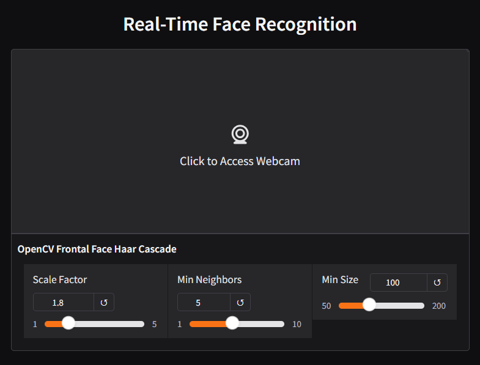

# Real-Time Face Recognition




## Requirements

Docker (Docker Compose) is required.

## Installation

You can pull the image from Docker Hub:

```bash
docker-compose pull
```

Or, you can build the image from source by yourself, but it may take a few minutes to download and install the dependencies:

```bash
docker-compose build
```

## Usage

Start the containers:

```bash
docker-compose up -d
```

Then, go to <http://localhost:7860>.

To stop the containers, run:

```bash
docker-compose down -v
```

## To-Dos

* [x] Use OpenCV Haar Cascade
* [x] Use Gradio
* [ ] Isolate frontend and backend into different images
* [ ] Try other face recognition techniques (e.g., DeepFace)
* [ ] Make a Live Demo
